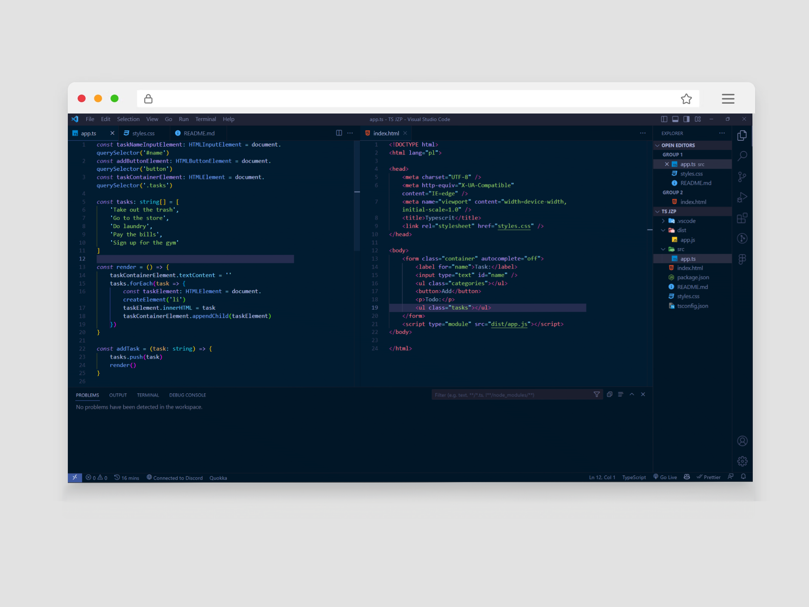

# RudyDev Theme [Edited Tokyo Night Storm]

## Changes colors:

| Color&nbsp;&nbsp;&nbsp;&nbsp;&nbsp;&nbsp;&nbsp;&nbsp;&nbsp;&nbsp;&nbsp;&nbsp;&nbsp;&nbsp;&nbsp; | Use |
| ---------- | ------------------------------------------------------------ |
|  `#011c31` | background |
|  `#252d4f` | line highlight background |
|  `#011627` | group border, widget background, sideBar background, activityBar.background, statusBar.background, panel.background, terminal.background, editorGroupHeader.tabsBackground, tab.inactiveBackground  |
|  `#41496b` | activityBar.activeBorder, activityBar.inactiveForeground |
<!-- |  `#01192c` | editorGutter.background | -->
and more...

## Screenshots

## Credits

- This theme was created by modifying this theme: [Tokyo Night](https://github.com/enkia/tokyo-night-vscode-theme)